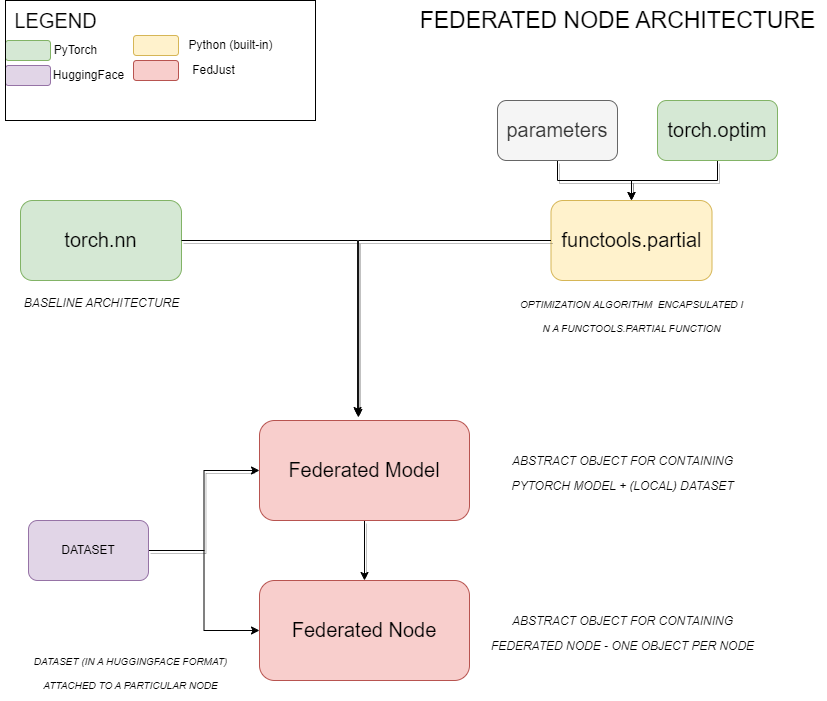
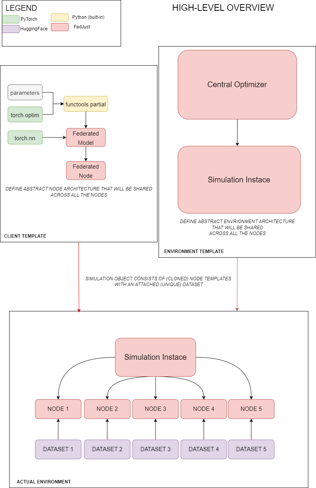

# What is FedJust?

FedJust was projected to be a fully adjustable code base that takes off the need to write boilerplate code for Federated Learning. Its components are fully modifiable building blocks that can be adjusted to your needs in a few lines of code. FedJust was designed to be a minimalist Python boilerplate for running Federated simulations (on a single or multiple GPUs at the same time). It does not aim to work as a Federated framework for actual communication between the devices, as there are already frameworks for doing that, e.g. [Flower](https://flower.ai/docs/framework/tutorial-series-what-is-federated-learning.html) or part of [PySyft](https://github.com/OpenMined/PySyft). However, the niche of a well-documented and easily adjustable framework for the customization of FL experiments is still open - hence a FedJust tries to deliver the most straightforward boilerplate ecosystem that you may need for performing decentralised simulations in a controlled environment.

# How to use FedJust?

As FedJust was designed to be an easy-to-use boilerplate, it comes in several different ways to use it.

**Python pip**

As FedJust is registered in the Python Package Index (PyPI), it can be downloaded using the pip install command. Simply run:
``pip install fedjust``

**Template Cloning**

This GitHub repository is set up as a public template repository. It means, that it is possible to simply clone it and use it as a standalone repository without actually forking it. The package is built with the help of [Poetry](https://python-poetry.org/). To install the project together with a virtual environment, navigate to the main folder and run:
``poetry install``.

The virtual environment will be installed together with the required dependencies.

# FedJust - Architectural Design

FedJust was designed to be fully customizable on three different layers:

- Local Client Design
- Environment Design
- Federated Learning Simulation

This is directly reflected in the architectural philosophy of the library. FedJust was built on top of PyTorch's and HuggingFace's capabilities.

## Local Client Design

The basic building block upon which the whole structure of the library is built is the **Client Template Design**. This abstract class encapsulates the template of the local client and will be cloned the desired number of times to decentralize multiple (individual) agents that are present in the environment. It consists of an object constructed from the ***Federated Model class***, which consists of [torch.nn architecture](https://pytorch.org/docs/stable/nn.html) and a [torch.optim object](https://pytorch.org/docs/stable/optim.html#module-torch.optim) passed in a Python's [functools.partial](https://docs.python.org/3/library/functools.html) higher-order function. This ***Federated Model* **object will be used to instantiate the ***Federated Node*** object. ***Federated Node*** objects, together with ***Federated Model Objects***, serve as a template that will be cloned a number of times and will represent the local nodes. This is represented in the diagram below.

## Environment Design

The simulation environment consists of a **Simulation Instance** - that is, an abstract object that encapsulates all the simulated environmental variables and conditions, including attached copies of the particular nodes with their corresponding local datasets. This is represented in the diagram below.

## Federated Learning Simulation

The (actual) Federated Learning Simulation is controlled through the previously defined *Simulation Instance* object. *Simulation Instance* accepts the Template of a *Federated Node* defined as above, clones it desired a number of times and attached the corresponding datasets to it. While the *Federated Node* template is abstract and generic, it becomes individualised when the corresponding dataset is attached to it. From this moment onwards, it can be retrieved as an individualised node using the *Simulation Instance* API. This is represented in the diagram below.

# FedJust - Full Documentation

The full documentation can be found at [FedJust](https://mkzuziak.github.io/FedJust/).
